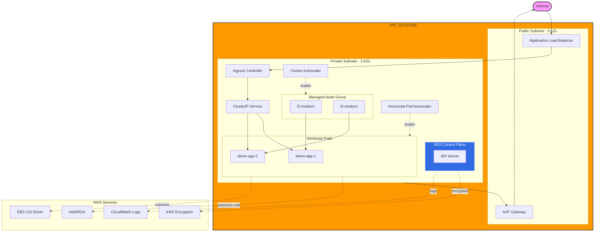

# Kubernetes Baseline — EKS with Terraform

[](https://github.com/justin-henson/au-nz-k8s-baseline-eks/actions/workflows/validate.yml)
[](https://opensource.org/licenses/MIT)

A production-ready Amazon EKS cluster provisioned with Terraform, demonstrating Kubernetes best practices for security, autoscaling, and operational excellence.

**Portfolio Project for AU/NZ DevOps Roles** | [Justin Henson](https://github.com/justin-henson)

---

## 📋 Table of Contents

- [Quick Review for Hiring Managers](#-quick-review-for-hiring-managers-60-seconds)
- [What This Proves](#-what-this-proves)
- [Architecture](#-architecture)
- [Features](#-features)
- [Deploy It Yourself](#-deploy-it-yourself)
- [Project Structure](#-project-structure)
- [Connects To](#-connects-to)
- [Cost Warning](#-cost-warning)
- [License](#-license)

---

## 🎯 Quick Review for Hiring Managers (60 seconds)

**Looking to evaluate Kubernetes expertise quickly? Start here:**

1. **Infrastructure as Code:** [`terraform/eks.tf`](terraform/eks.tf) — Modern EKS setup with IRSA, managed node groups, control plane logging

2. **Security Implementation:** [`k8s/demo-app/deployment.yaml`](k8s/demo-app/deployment.yaml) — Non-root containers, read-only filesystem, Pod Security Standards, resource limits

3. **IRSA Setup:** [`terraform/iam.tf`](terraform/iam.tf) — IAM Roles for Service Accounts (the secure way to grant AWS permissions to pods)

4. **Autoscaling:** [`k8s/demo-app/hpa.yaml`](k8s/demo-app/hpa.yaml) — Horizontal Pod Autoscaler configuration

5. **Network Security:** [`k8s/demo-app/network-policy.yaml`](k8s/demo-app/network-policy.yaml) — Default deny + explicit allow policies

6. **Operational Runbooks:** [`docs/UPGRADE-RUNBOOK.md`](docs/UPGRADE-RUNBOOK.md) — Detailed EKS upgrade procedures

**Key Talking Points:**
- ✅ Why IRSA over node-level IAM roles → [`docs/DECISION-LOG.md`](docs/DECISION-LOG.md#decision-3-irsa-vs-node-level-iam-roles)
- ✅ Cost vs HA trade-offs → [`docs/COST-ESTIMATE.md`](docs/COST-ESTIMATE.md)
- ✅ Zero-trust networking → [`k8s/security/`](k8s/security/)

---

## 🏗 Architecture



**Traffic Flow:** Internet → ALB → Ingress Controller → Service → Pods → AWS APIs (via IRSA)

**Detailed architecture documentation:** [`docs/ARCHITECTURE.md`](docs/ARCHITECTURE.md)

---

## ✨ Features

### Infrastructure (Terraform)
- ✅ **EKS 1.31** with managed control plane (HA across 3 AZs)
- ✅ **VPC with public/private subnets** (3 AZs, NAT Gateway)
- ✅ **Managed node group** (t3.medium, min 1 / max 4, autoscaling)
- ✅ **IRSA (IAM Roles for Service Accounts)** for pod-level AWS permissions
- ✅ **KMS envelope encryption** for Kubernetes secrets
- ✅ **Control plane logging** (API, audit, authenticator)
- ✅ **EKS add-ons:** CoreDNS, kube-proxy, VPC CNI, EBS CSI driver

### Kubernetes Workloads
- ✅ **Demo application** (httpbin) with production-ready configuration
- ✅ **Horizontal Pod Autoscaler** (CPU/memory based, 2-6 replicas)
- ✅ **Ingress with ALB** (AWS Load Balancer Controller integration)
- ✅ **Network policies** (default deny + explicit allow)
- ✅ **Pod Security Standards** (restricted profile enforced)
- ✅ **Resource quotas and limits** per namespace
- ✅ **RBAC policies** (example dev team roles)

### Security Hardening
- ✅ **Non-root containers** with read-only root filesystem
- ✅ **Capability dropping** (no privileged containers)
- ✅ **IMDSv2 enforced** on nodes
- ✅ **Private subnets** for all compute
- ✅ **Security groups** and network policies
- ✅ **Secrets encryption at rest** (KMS)

### Operational Excellence
- ✅ **Cluster Autoscaler** setup notes
- ✅ **Metrics Server** for HPA
- ✅ **Health checks** (readiness + liveness probes)
- ✅ **Validation scripts** (post-deploy health checks)
- ✅ **Upgrade runbook** (step-by-step procedures)
- ✅ **Teardown script** (ordered cleanup to avoid orphaned resources)

---

## 💡 What This Proves

This repository demonstrates:

1. **Cluster Provisioning:** Infrastructure as Code for production EKS clusters
2. **Security Hardening:** IRSA, Pod Security Standards, network policies, encrypted secrets
3. **Workload Deployment:** Production-ready deployments with health checks and resource limits
4. **Autoscaling:** Pod-level (HPA) and node-level (Cluster Autoscaler) scaling
5. **AWS Integration:** ALB Ingress, EBS CSI, IAM, KMS, CloudWatch
6. **Operational Knowledge:** Upgrade procedures, cost estimation, troubleshooting

**Skills showcased:**
- Terraform (AWS provider, modules, state management)
- Kubernetes (deployments, services, ingress, autoscaling)
- AWS (EKS, VPC, IAM, ALB, EBS, KMS)
- Security (IRSA, network policies, Pod Security Standards)
- GitOps/CI (GitHub Actions validation pipeline)
- Documentation (architecture diagrams, runbooks, decision logs)

---

## 🚀 Deploy It Yourself

### Prerequisites

**Required tools:**
- [Terraform](https://www.terraform.io/downloads) >= 1.9
- [AWS CLI](https://aws.amazon.com/cli/) >= 2.x (configured with credentials)
- [kubectl](https://kubernetes.io/docs/tasks/tools/) >= 1.31
- [Helm](https://helm.sh/docs/intro/install/) >= 3.x (for optional components)

**AWS requirements:**
- AWS account with admin access (or sufficient IAM permissions)
- AWS CLI configured: `aws configure`
- Default VPC quotas are sufficient (no special limits needed)

**Estimated deployment time:** 15-20 minutes

**⚠️ COST WARNING:** This will incur AWS charges (~$7/day or ~$207/month). See [`docs/COST-ESTIMATE.md`](docs/COST-ESTIMATE.md) for breakdown.

---

### Step 1: Clone the Repository

```bash
git clone https://github.com/justin-henson/au-nz-k8s-baseline-eks.git
cd au-nz-k8s-baseline-eks
```

---

### Step 2: Configure Variables (Optional)

Edit [`terraform/variables.tf`](terraform/variables.tf) to customize:

```hcl
variable "aws_region" {
  default = "ap-southeast-2"  # Sydney — change if needed
}

variable "cluster_name" {
  default = "baseline-eks"  # Change if you want a different name
}

variable "allowed_cidr_blocks" {
  # IMPORTANT: Restrict to your IP for security
  default = ["0.0.0.0/0"]  # Change to ["YOUR_IP/32"] in production
}
```

**Recommended:** Set `allowed_cidr_blocks` to your public IP to restrict EKS API access.

---

### Step 3: Deploy Infrastructure

```bash
cd terraform

# Initialize Terraform
terraform init

# Preview changes
terraform plan

# Deploy (will prompt for confirmation)
terraform apply

# Save outputs for later use
terraform output
```

**What gets created:**
- VPC with public/private subnets across 3 AZs
- EKS cluster with control plane
- Managed node group (2 nodes)
- IAM roles for IRSA
- EKS add-ons (CoreDNS, kube-proxy, VPC CNI, EBS CSI)
- Security groups, NAT Gateway, KMS key

**Expected time:** 12-15 minutes

---

### Step 4: Configure kubectl

```bash
# From project root
./scripts/connect.sh
```

Or manually:
```bash
aws eks update-kubeconfig --region ap-southeast-2 --name baseline-eks
kubectl cluster-info
```

---

### Step 5: Deploy Kubernetes Resources

```bash
# Deploy namespaces
kubectl apply -f k8s/namespaces/

# Deploy demo app
kubectl apply -f k8s/demo-app/

# Deploy security policies
kubectl apply -f k8s/security/

# Verify deployment
kubectl get pods -n demo-app
kubectl get ingress -n demo-app
```

**Note:** The Ingress will provision an ALB, which takes 2-3 minutes. Check status:
```bash
kubectl get ingress -n demo-app -w
```

---

### Step 6: Install Cluster Add-ons (Optional)

**AWS Load Balancer Controller** (for Ingress to work):
```bash
# Get IAM role ARN
terraform output -raw aws_lb_controller_role_arn

# Install via Helm
helm repo add eks https://aws.github.io/eks-charts
helm repo update
helm install aws-load-balancer-controller eks/aws-load-balancer-controller \
  --namespace kube-system \
  --set clusterName=baseline-eks \
  --set serviceAccount.create=true \
  --set serviceAccount.name=aws-load-balancer-controller \
  --set serviceAccount.annotations."eks\.amazonaws\.com/role-arn"=<ROLE_ARN_FROM_TERRAFORM_OUTPUT>
```

**Metrics Server** (for HPA):
```bash
kubectl apply -f https://github.com/kubernetes-sigs/metrics-server/releases/latest/download/components.yaml
```

See [`k8s/cluster-ops/`](k8s/cluster-ops/) for detailed installation instructions.

---

### Step 7: Validate Cluster

```bash
./scripts/validate-cluster.sh
```

This checks:
- All nodes are Ready
- System pods are running
- DNS resolution works
- No failed pods

---

### Step 8: Test the Demo App

```bash
# Get ALB URL
ALB_URL=$(kubectl get ingress demo-app -n demo-app -o jsonpath='{.status.loadBalancer.ingress[0].hostname}')

# Test the application
curl http://$ALB_URL/status/200
curl http://$ALB_URL/headers

# Or open in browser
echo "http://$ALB_URL"
```

---

### Step 9: Test Autoscaling (Optional)

**Test Horizontal Pod Autoscaler:**
```bash
# Generate load
kubectl run load-generator -n demo-app --image=busybox:1.36 --restart=Never -- /bin/sh -c "while true; do wget -q -O- http://demo-app/status/200; done"

# Watch HPA scale up
watch kubectl get hpa -n demo-app

# Watch pods scale
kubectl get pods -n demo-app -w

# Cleanup
kubectl delete pod load-generator -n demo-app
```

**Monitor Cluster Autoscaler** (if installed):
```bash
kubectl logs -n kube-system -l app=cluster-autoscaler
```

---

### Step 10: Teardown

**⚠️ Important:** Delete Kubernetes resources *before* running `terraform destroy` to avoid orphaned AWS resources (ENIs, ELBs, EBS volumes).

```bash
# Automated teardown (recommended)
./scripts/teardown.sh

# Or manual teardown
kubectl delete -f k8s/demo-app/
kubectl delete -f k8s/namespaces/
kubectl delete -f k8s/security/

# Wait 2-3 minutes for ALB to be deleted

cd terraform
terraform destroy
```

---

## 📁 Project Structure

```
au-nz-k8s-baseline-eks/
├── README.md                    # You are here
├── LICENSE                      # MIT License
│
├── terraform/                   # Infrastructure as Code
│   ├── main.tf                  # Root module
│   ├── versions.tf              # Provider version constraints
│   ├── providers.tf             # AWS provider configuration
│   ├── variables.tf             # Input variables
│   ├── outputs.tf               # Output values
│   ├── vpc.tf                   # VPC and networking
│   ├── eks.tf                   # EKS cluster and node groups
│   ├── iam.tf                   # IAM roles for IRSA
│   └── addons.tf                # EKS managed add-ons
│
├── k8s/                         # Kubernetes manifests
│   ├── namespaces/              # Namespace definitions
│   │   ├── demo-app.yaml        # Demo app namespace with quotas
│   │   └── monitoring.yaml      # Monitoring namespace
│   ├── demo-app/                # Demo application
│   │   ├── deployment.yaml      # Deployment with security context
│   │   ├── service.yaml         # ClusterIP service
│   │   ├── ingress.yaml         # ALB Ingress
│   │   ├── hpa.yaml             # Horizontal Pod Autoscaler
│   │   └── network-policy.yaml  # Network policies
│   ├── security/                # Security policies
│   │   ├── pod-security-standards.yaml  # PSS documentation
│   │   └── rbac.yaml            # RBAC roles and bindings
│   └── cluster-ops/             # Cluster operations
│       ├── aws-lb-controller.yaml      # ALB controller setup
│       ├── metrics-server.yaml         # Metrics server setup
│       └── cluster-autoscaler.yaml     # Cluster Autoscaler setup
│
├── scripts/                     # Operational scripts
│   ├── connect.sh               # Configure kubectl
│   ├── validate-cluster.sh      # Post-deploy validation
│   └── teardown.sh              # Ordered resource cleanup
│
├── docs/                        # Documentation
│   ├── ARCHITECTURE.md          # Detailed architecture + Mermaid diagrams
│   ├── DECISION-LOG.md          # Design decisions and trade-offs
│   ├── COST-ESTIMATE.md         # Monthly cost breakdown
│   └── UPGRADE-RUNBOOK.md       # EKS version upgrade procedures
│
└── .github/
    └── workflows/
        └── validate.yml         # CI: Terraform + K8s validation
```

---

## 🔗 Connects To

This repository is part of a portfolio demonstrating end-to-end DevOps capabilities:

- **[au-nz-cloud-baseline-aws](https://github.com/justin-henson/au-nz-cloud-baseline-aws)** — AWS networking patterns (VPC, Transit Gateway, multi-account setup)
  - *Connection:* This EKS cluster builds on the VPC architecture principles from the cloud baseline

- **[au-nz-cicd-pipeline](https://github.com/justin-henson/au-nz-cicd-pipeline)** — CI/CD pipeline automation
  - *Connection:* How this EKS infrastructure would be deployed via GitOps pipeline

- **[au-nz-ops-runbooks](https://github.com/justin-henson/au-nz-ops-runbooks)** — Operational procedures and incident response
  - *Connection:* EKS upgrade procedures tie into the runbook style demonstrated there

**Together, these repos show:**
- Cloud foundation → Container orchestration → CI/CD automation → Operational procedures

---

## 💰 Cost Warning

**Estimated monthly cost:** ~$207 USD (Sydney region)

**Breakdown:**
- EKS control plane: $73/month
- 2x t3.medium nodes: $60/month
- NAT Gateway: $48/month
- ALB: $20/month
- EBS, CloudWatch, KMS: $6/month

**For reviewers testing this:**
- Deploy for a few hours: ~$2-5 total cost
- Use `./scripts/teardown.sh` to clean up

**Full cost breakdown:** [`docs/COST-ESTIMATE.md`](docs/COST-ESTIMATE.md)

---

## 🛡️ Security Considerations

**For production use, consider:**

1. **Restrict API access:** Change `allowed_cidr_blocks` in `variables.tf` to your IP
2. **Enable private endpoint:** Set `cluster_endpoint_public_access = false` in `eks.tf`
3. **Use secrets management:** Integrate AWS Secrets Manager or HashiCorp Vault
4. **Enable GuardDuty:** For runtime threat detection
5. **Use Calico/Cilium:** For advanced network policies (L7 filtering)
6. **Implement image scanning:** Use ECR image scanning or Trivy
7. **Enable audit logging:** Already enabled, but review and alert on suspicious activity

---

## 📚 Additional Resources

- [AWS EKS Best Practices Guide](https://aws.github.io/aws-eks-best-practices/)
- [Kubernetes Security Best Practices](https://kubernetes.io/docs/concepts/security/)
- [IRSA Deep Dive](https://docs.aws.amazon.com/eks/latest/userguide/iam-roles-for-service-accounts.html)
- [Pod Security Standards](https://kubernetes.io/docs/concepts/security/pod-security-standards/)

---

## 🤝 Contributing

This is a portfolio project, but feedback and suggestions are welcome! Feel free to:
- Open an issue for questions or improvements
- Submit a PR for bug fixes or documentation updates

---

## 📄 License

This project is licensed under the MIT License — see the [LICENSE](LICENSE) file for details.

---

## 👤 Author

**Justin Henson**

- GitHub: [@justin-henson](https://github.com/justin-henson)
- Portfolio: Demonstrating DevOps expertise for AU/NZ market

---

## ⭐ Acknowledgments

- AWS EKS team for the official Terraform modules
- Kubernetes community for excellent documentation
- AU/NZ DevOps community for feedback on portfolio projects

---

**Questions? Found a bug? Want to chat about Kubernetes?**
[Open an issue](https://github.com/justin-henson/au-nz-k8s-baseline-eks/issues) or connect on LinkedIn.
