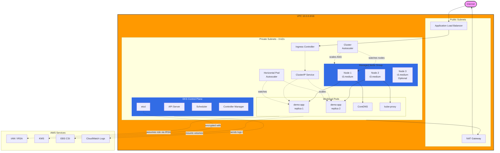

# Architecture

This document describes the architecture of the EKS baseline cluster, including networking, compute, and workload deployment patterns.

## High-Level Architecture

## Layer-by-Layer Breakdown

### 1. Network Layer (VPC)

**CIDR Block:** `10.0.0.0/16`

**Subnets across 3 Availability Zones:**
- **Public Subnets** (`10.0.48.0/24`, `10.0.49.0/24`, `10.0.50.0/24`)
  - Internet Gateway attached
  - Hosts: ALB, NAT Gateway
  - Tagged with `kubernetes.io/role/elb=1` for EKS auto-discovery

- **Private Subnets** (`10.0.0.0/20`, `10.0.16.0/20`, `10.0.32.0/20`)
  - Routes to NAT Gateway for internet access
  - Hosts: EKS control plane ENIs, worker nodes, pods
  - Tagged with `kubernetes.io/role/internal-elb=1` for internal load balancers

**Why this design?**
- Nodes in private subnets reduce attack surface
- Single NAT Gateway saves cost in demo (prod should use one per AZ for HA)
- 3 AZs provide high availability for control plane and workloads

### 2. Compute Layer (EKS Cluster)

**EKS Control Plane:**
- Managed by AWS (fully patched, highly available)
- Spread across 3 AZs automatically
- API server accessible via public endpoint (restricted to allowed CIDRs)
- Logs sent to CloudWatch: API, audit, authenticator, controller manager, scheduler

**Managed Node Group:**
- Instance type: `t3.medium` (2 vCPU, 4 GiB RAM)
- Desired: 2 nodes, Min: 1, Max: 4
- On-demand capacity (for reliability; can use Spot for cost savings)
- EBS volumes: 50 GiB gp3, encrypted
- IMDSv2 enforced (security best practice)
- Auto Scaling Group tags allow Cluster Autoscaler to manage size

**Why managed node groups?**
- AWS handles AMI patching and updates
- Simplified node lifecycle management
- Automatic integration with EKS control plane
- Alternative: Karpenter for more flexible provisioning

### 3. Security Layer

**IAM Roles for Service Accounts (IRSA):**
- OIDC provider enabled on EKS cluster
- Pods assume IAM roles via web identity federation
- No AWS credentials in pods or environment variables
- Fine-grained permissions per workload

**Pod Security Standards:**
- `restricted` profile enforced on demo-app namespace
- Requires: non-root user, read-only root filesystem, no privilege escalation
- All capabilities dropped

**Network Policies:**
- Default deny all ingress traffic
- Explicit allow rules for ALB → pods, monitoring → pods
- Egress allowed for DNS and external HTTPS

**Encryption:**
- Secrets encrypted at rest with KMS (envelope encryption)
- EBS volumes encrypted
- TLS for all control plane communication

### 4. Workload Layer (Demo App)

**Deployment:**
- 2 replicas (min), 6 replicas (max via HPA)
- Resource requests: 100m CPU, 128Mi memory
- Resource limits: 500m CPU, 512Mi memory
- Readiness + liveness probes for health checks
- Pod anti-affinity prefers spreading across nodes

**Service:**
- ClusterIP type (internal only)
- Selector: `app=demo-app`
- Exposes port 80 → container port 8080

**Ingress:**
- AWS Load Balancer Controller provisions ALB
- `internet-facing` scheme
- `ip` target type (pods directly targeted, not nodes)
- Health checks on `/status/200`

**Horizontal Pod Autoscaler:**
- Scale on CPU (70%) and memory (80%) utilization
- Scale up: fast (30s stabilization)
- Scale down: gradual (300s stabilization, prevents flapping)

### 5. Autoscaling

**Pod-level (HPA):**
- Metrics Server collects pod CPU/memory usage
- HPA controller adjusts Deployment replicas
- Reacts to traffic spikes in seconds to minutes

**Node-level (Cluster Autoscaler):**
- Watches for unschedulable pods (insufficient capacity)
- Scales up by increasing ASG desired capacity
- Scales down by removing underutilized nodes (after 10 min)
- Considers pod disruption budgets and local storage

**Combined effect:**
- HPA scales pods → may exceed node capacity → CA adds nodes
- Load decreases → HPA scales down pods → CA removes empty nodes

## Traffic Flow

### Inbound Request (Internet → Pod)

1. **Client** sends HTTPS request to ALB DNS name
2. **ALB** terminates TLS (if configured), selects healthy target
3. **Target** is a pod IP (not node IP) via `target-type: ip`
4. **Ingress Controller** (AWS LB Controller) configured ALB target group
5. **Service** provides stable endpoint, load balances across pod IPs
6. **Pod** receives request on port 8080, processes, responds

### Outbound Request (Pod → Internet)

1. **Pod** initiates connection (e.g., API call to AWS S3)
2. **VPC CNI** routes traffic via node's network interface
3. **Node** routes to VPC default route (0.0.0.0/0 → NAT Gateway)
4. **NAT Gateway** (in public subnet) performs source NAT
5. **Internet Gateway** routes to internet

### Pod-to-Pod Communication

1. **Pod A** resolves service name via CoreDNS
2. **Service** returns ClusterIP (virtual IP)
3. **kube-proxy** (iptables or IPVS) rewrites destination to pod IP
4. **VPC CNI** routes directly to pod (same or different node)
5. **Pod B** receives request

## AWS Services Integration

| Service | Purpose | Configuration |
|---------|---------|---------------|
| **EKS** | Managed Kubernetes control plane | Version 1.31, HA across 3 AZs |
| **EC2** | Worker nodes | t3.medium, managed node group |
| **VPC** | Network isolation | 10.0.0.0/16, 3 AZs, public + private subnets |
| **ALB** | Application Load Balancer | Provisioned by Ingress resources |
| **EBS** | Persistent storage | CSI driver, gp3 volumes |
| **KMS** | Encryption | Envelope encryption for secrets |
| **IAM** | Access control | IRSA for pod-level permissions |
| **CloudWatch** | Logging & monitoring | Control plane logs, container insights |
| **Route 53** | DNS (optional) | Can point custom domain to ALB |

## High Availability

**Control Plane:**
- AWS-managed, automatically distributed across 3 AZs
- RPO: ~0 (etcd replicated)
- RTO: ~15 minutes (AWS SLA)

**Worker Nodes:**
- Spread across multiple AZs (if desired > 1)
- Pod anti-affinity encourages spreading
- Cluster Autoscaler can replace failed nodes

**Application:**
- Min 2 replicas (survives 1 pod failure)
- Readiness probes remove unhealthy pods from service
- HPA can scale up during traffic spikes

**Network:**
- ALB health checks (15s interval, 2 failures threshold)
- Multiple targets across AZs
- DNS TTL: 60s for failover

## Monitoring & Observability

**Metrics:**
- Metrics Server: pod/node CPU and memory
- CloudWatch Container Insights: cluster-level metrics
- Prometheus (optional): custom application metrics

**Logs:**
- EKS control plane logs → CloudWatch Logs
- Container logs: `kubectl logs` or CloudWatch (via Fluent Bit)
- Audit logs: API server audit events

**Tracing:**
- Can integrate AWS X-Ray or OpenTelemetry for distributed tracing

## Cost Optimization

**Current configuration (demo):**
- Single NAT Gateway (HA would use 3)
- 2x t3.medium nodes (smallest recommended for demos)
- Cluster Autoscaler scales down to 1 node when idle

**Further optimizations:**
- Use Spot instances for non-critical workloads (60-90% discount)
- Use Fargate for intermittent workloads (no idle node cost)
- Karpenter for better bin-packing (fewer wasted resources)
- Reserved Instances or Savings Plans for predictable workloads

## Security Best Practices Implemented

✅ **Network:**
- Private subnets for all compute
- Security groups restrict traffic
- Network policies enforce pod-level firewall rules

✅ **Compute:**
- IMDSv2 enforced (prevents SSRF attacks)
- EBS encryption at rest
- Regular node AMI updates via managed node groups

✅ **Application:**
- Non-root containers
- Read-only root filesystem
- All capabilities dropped
- Resource limits prevent resource exhaustion

✅ **Access Control:**
- IRSA instead of node-level IAM roles
- RBAC policies limit user/service account permissions
- Pod Security Standards enforce security policies

✅ **Data:**
- Secrets encrypted with KMS
- TLS for all control plane communication
- Audit logging enabled

## References

- [EKS Best Practices Guide](https://aws.github.io/aws-eks-best-practices/)
- [Kubernetes Architecture](https://kubernetes.io/docs/concepts/architecture/)
- [AWS VPC Best Practices](https://docs.aws.amazon.com/vpc/latest/userguide/vpc-security-best-practices.html)
